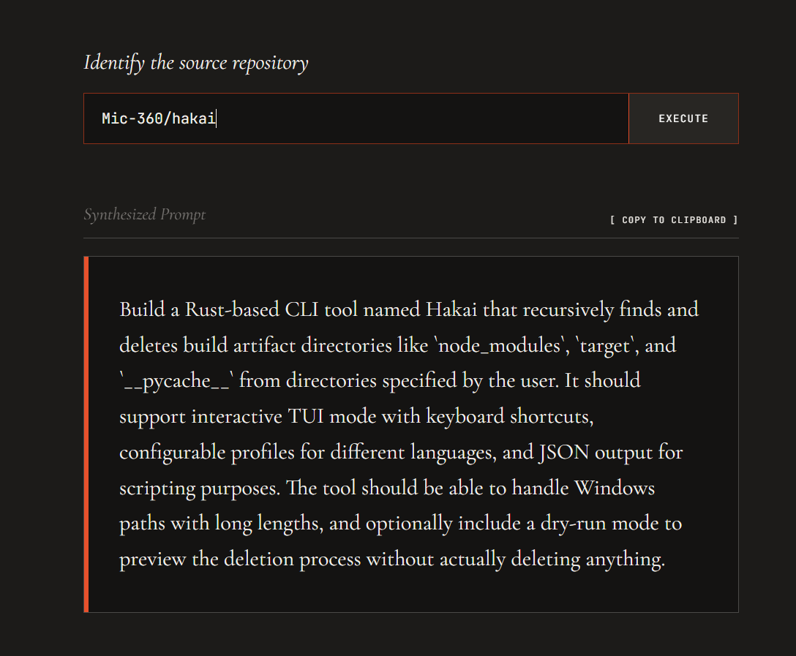

# Repo &rarr; Prompt Synthesizer

A high-fidelity translation engine running directly in your browser. This application converts public GitHub repositories into human-like "vibe-coding" requests using Google's experimental embedded Gemini Nano model.



> Link to the Hakai Repo to verify how good the generated prompt is: https://github.com/Mic-360/hakai

## Features

- **On-Device Inference**: Parses and synthesizes repository contexts entirely locally using Chrome's experimental AI Prompt API. Zero external API keys or server-side AI processing required.
- **Repository Parsing**: Automatically fetches and aggregates project metadata, depth-1 file trees, and `README.md` contents directly from the GitHub API.
- **High-End UI**: Features a distinctive, luxury-editorial "Neo-Technical" aesthetic built with Tailwind CSS, breaking away from generic web interfaces.
- **Fully Responsive**: Flawless interface scaling and horizontal overflow protections, adapting cleanly from tiny mobile displays up to ultrawide desktops.

## Prerequisites

This application relies on the experimental `window.ai.languageModel` (Prompt API) built into modern versions of Google Chrome.

To run this application locally, you **must** configure your Chrome environment:

1. **Update Chrome**: Ensure you are running Google Chrome version `127` or higher.
2. **Enable Flags**:
   - Navigate to `chrome://flags`
   - Set **Prompt API for Gemini Nano** to `Enabled`
   - Set **Optimization Guide On Device Model** to `Enabled BypassPerfRequirement`
   - Relaunch Chrome.
3. **Download the Model**:
   - Navigate to `chrome://components`
   - Find `Optimization Guide On Device Model` and click "Check for update".
   - Wait for the model to download (this may take a few minutes).

## Getting Started

1. Clone this repository locally.
2. Install the necessary dependencies:
   ```bash
   npm install
   ```
3. Start the Vite development server:
   ```bash
   npm run dev
   ```

## Stack

- **React & TypeScript**
- **Vite**
- **Tailwind CSS v4**
- **Google Chrome Prompt API**

## UI Architecture

The application has been modularized away from a monolithic state file for simpler maintenance:

- `App.tsx`: Main route and global layout.
- `PromptGenerator.tsx`: Core logic handling fetching, prompt tuning, Chrome AI generation, and interactive UI states.
- `Guide.tsx`: Isolated responsive step-by-step setup guide.
- `chrome-ai.d.ts`: Isolated TypeScript definitions for the experimental Chrome `window.ai` spec.

## Note on Synthetic Prompt Generation

The internal prompt context fed to Gemini Nano has been rigorously optimized to fit the constraints of a ~3B parameter model. It uses positive instruction constraints and single-shot examples rather than complex multi-level rulesets to ensure high-accuracy natural-language outputs.
